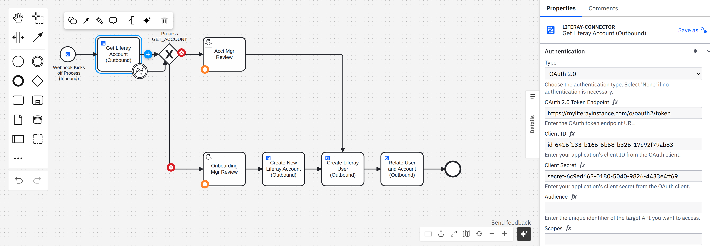
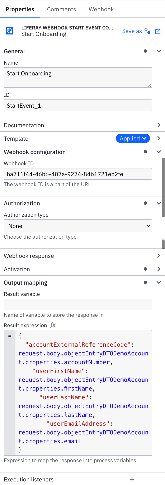
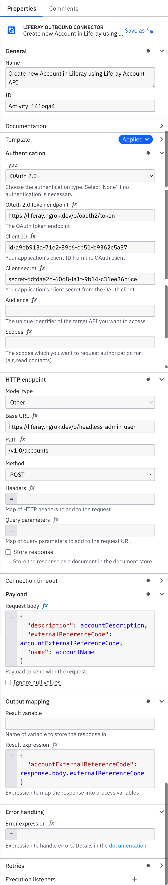

# Using Liferay Camunda Inbound and Outbound Connectors

## Introduction

Camunda is a leading open-source workflow and decision automation platform that enables organizations to design, automate, and improve business processes. Camunda 8 is the latest cloud-native version built on a microservices architecture, offering scalability, resilience, and high performance for mission-critical process automation.

Key features of Camunda include:

- **BPMN-based Process Automation**: Camunda uses the industry-standard Business Process Model and Notation (BPMN) for process design, making it accessible to both business and technical users.
- **Decision Automation**: With DMN (Decision Model and Notation) support, Camunda enables complex business rules and decision logic.
- **Cloud-Native Architecture**: Camunda 8 is built on a scalable, distributed architecture with components like Zeebe (workflow engine), Operate (monitoring), and Tasklist (task management).
- **API-First Approach**: Camunda provides comprehensive APIs and connectors for integration with various systems.

This blog post explores how to use Liferay Camunda inbound and outbound connectors to integrate Liferay DXP with Camunda 8 processes. By combining Liferay's digital experience capabilities with Camunda's process automation, organizations can create powerful end-to-end solutions that streamline operations while delivering exceptional user experiences.

We'll use the "Onboarding Demo" process as a practical example to demonstrate these integration capabilities, showing how Liferay events can trigger Camunda processes and how Camunda workflows can interact with Liferay's APIs to create and manage users and accounts.

## Overview of the Onboarding Demo Process

The Onboarding Demo process demonstrates how to automate user onboarding in Liferay DXP using Camunda 8. The process:

1. Starts when a webhook event is received from Liferay
2. Checks if an account exists for the user
3. Routes the request to appropriate reviewers based on account status
4. Creates an account if needed
5. Creates a user account
6. Associates the user with the account

## Inbound Connectors: Liferay Webhook Start Event

The process begins with a Liferay Webhook Start Event connector that receives events from Liferay DXP.

### How the Webhook Connector Works

The webhook connector is configured as a start event in the BPMN process. It:

1. Listens for incoming HTTP requests from Liferay
2. Extracts data from the request payload
3. Initiates a new process instance with the extracted data

### Configuration in the BPMN Process

In our Onboarding Demo, the start event is configured with these properties:

This configuration:
- Uses the Liferay webhook connector
- Accepts any HTTP method
- Defines a unique context ID for this webhook
- Doesn't require authentication
- Extracts specific fields from the request body using a result expression

## Outbound Connectors: Liferay Connector for Liferay APIs

The Onboarding Demo process uses the Liferay connector to interact with Liferay's REST APIs.

### Types of API Calls in the Process

The process makes several API calls to Liferay:

1. **Check Account Existence**: Verifies if an account already exists
2. **Create Account**: Creates a new account if needed
3. **Create User Account**: Creates a new user account
4. **Associate User with Account**: Links the user to the account

### Configuration Example: Creating an Account

Here's how the "Create Account" service task is configured:

This configuration:
- Uses the Liferay connector
- Authenticates using OAuth 2.0 client credentials flow
- Specifies the Liferay API endpoint for creating accounts
- Defines the request body with account details
- Extracts the account's external reference code from the response

## Step-by-Step Guide: Setting Up the Connectors

### Requirements

Before setting up the connectors, ensure you have the following prerequisites in place:

#### On the Liferay Side

1. **DemoAccount Custom Object**: Create a custom object called "DemoAccount" with the following fields:
   - **name** (Text field)
   - **description** (Text field)

2. **Network Access**: If running Liferay locally, you'll need to use ngrok or a similar tool to expose your Liferay endpoints to the internet so Camunda Cloud can access them.

#### On the Camunda Cloud Side

1. **Import Connectors**: Import the following connector templates from the [Liferay Portal repository](https://github.com/liferay/liferay-portal/tree/master/modules/etl/camunda/element-templates):
   - `liferay-connector.json` (for outbound API calls to Liferay)
   - `liferay-webhook-connector-start-event.json` (for inbound webhook events from Liferay)

2. **Import Camunda Form**: Import the `New Account Form.form` file for creating new accounts in the process.

### Setting Up the Liferay Connector for Liferay APIs

1. **Obtain OAuth Credentials from Liferay**:
   - Create an OAuth 2.0 application in Liferay
   - Note the client ID and client secret

2. **Configure Service Tasks in Your BPMN Process**:
   - Add service tasks for each Liferay API interaction
   - Apply the HTTP JSON connector type
   - Configure authentication using the OAuth credentials
   - Define the API endpoints, methods, and request bodies
   - Set up result expressions to extract data from responses

3. **Handle Error Scenarios**:
   - Add boundary events to handle API errors
   - Configure error expressions to map HTTP error codes to BPMN errors

### Setting Up the Liferay Inbound Connector

1. **Configure the Start Event in Your BPMN Process**:
   - Add a start event to your BPMN diagram
   - Apply the "Liferay Webhook Start Event Connector" template
   - Configure the webhook properties (context ID, authentication, etc.)
   - Define the result expression to extract data from the webhook payload

2. **Deploy the Process to Camunda 8**:
   - Deploy the BPMN process to your Camunda 8 environment
   - Note the generated webhook URL for the start event

3. **Configure Liferay to Send Events to the Webhook**:
   - Set up an Object Action in Liferay that triggers on relevant events
   - Configure the action to send data to the Camunda webhook URL

## Complete Process File

You can download the complete BPMN process file here: [Onboarding Demo.bpmn](Onboarding%20Demo.bpmn)

## Conclusion

Liferay Camunda connectors provide a powerful way to integrate Liferay DXP with Camunda 8 processes. The inbound webhook connector enables Liferay to trigger processes in Camunda, while the outbound Liferay connector allows processes to interact with Liferay's APIs.

By following the patterns demonstrated in the Onboarding Demo process, you can implement sophisticated integration scenarios between Liferay and Camunda, enabling automated workflows that span both platforms.
